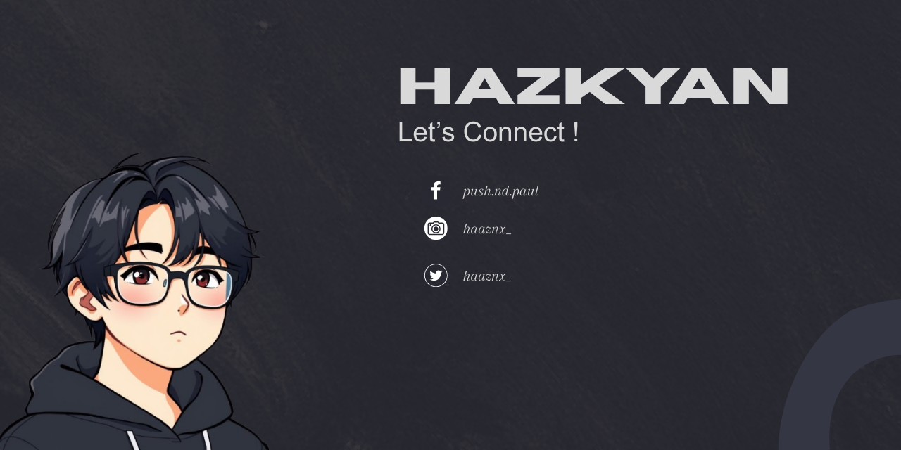

| Program/Course | School | School Year |
| :-------------: | :-----: | :-----------: |
| Bachelor of Science in Computer Science | New Era University | 2022 - 2026 |
| General Academic Strand Diploma  (SHS) | Remnant International Christian School | 2016 - 2022 |

 
 
 
 
 
 
 
 

|  |  |  |

  
| Certificate | Issued by | Date Issued |
| :------------- | :-----: | :-----------: |
| <a href="https://drive.google.com/file/d/1551PPIP0rRmtHNMjjfH3wAeDEV3JTGa6/view?usp=drive_link">Data Analysis with Python</a> | IBM Developer Skills Network | August 2025 |
| <a href="https://drive.google.com/file/d/1rJMW79FNnkwLRjjeE_8b51sLQgmmF8lF/view?usp=sharing">Digital Awareness</a> | Cisco | November 2024 |
| <a href="https://drive.google.com/file/d/1rJMW79FNnkwLRjjeE_8b51sLQgmmF8lF/view?usp=sharing">Digital Awareness</a> | Cisco | November 2024 |
| <a href="https://drive.google.com/file/d/1rJMW79FNnkwLRjjeE_8b51sLQgmmF8lF/view?usp=sharing">Digital Awareness</a> | Cisco | November 2024 |
| <a href="https://drive.google.com/file/d/1rJMW79FNnkwLRjjeE_8b51sLQgmmF8lF/view?usp=sharing">Digital Awareness</a> | Cisco | November 2024 |
| <a href="https://drive.google.com/file/d/1rJMW79FNnkwLRjjeE_8b51sLQgmmF8lF/view?usp=sharing">Digital Awareness</a> | Cisco | November 2024 |
| <a href="https://drive.google.com/file/d/1rJMW79FNnkwLRjjeE_8b51sLQgmmF8lF/view?usp=sharing">Digital Awareness</a> | Cisco | November 2024 |
| <a href="https://drive.google.com/file/d/1rJMW79FNnkwLRjjeE_8b51sLQgmmF8lF/view?usp=sharing">Digital Awareness</a> | Cisco | November 2024 |

